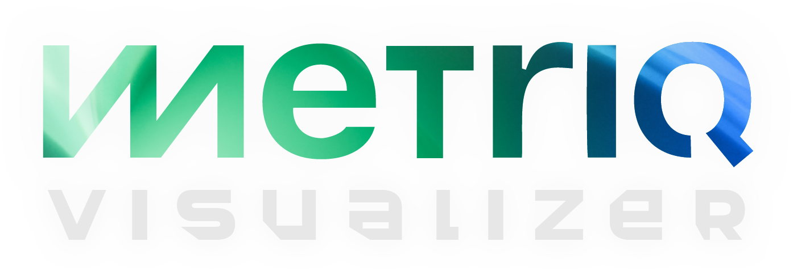

# Metriq Visualizer v1.10.18

Metriq Visualizer is an open-source multidimensional data and media visualizer.

It turns local audio, video, CSV, TSV, and XLSX data into interactive 3D geometry that you can scrub, inspect, and export as an MP4.


## About Metriq

Metriq builds technology intended to support real-world progress. The visual language behind this project reflects that broader design philosophy: clean, technical, and forward-looking.

## Features
- Local audio and video analysis
- Local CSV, TSV, and XLSX import for numeric datasets
- Formula-based mapping for X, Y, Z, color, and size
- Interactive geometry playback and timeline scrubbing
- Optional smooth spline path rendering for line and tube modes
- Save and reopen visualizer projects as `.mvproj`
- Save and reuse visualizer presets as `.mvpreset`
- Visualizer behavior presets are loaded from the local `presets/` directory next to the app. Add your own `.mvpreset` files there to populate the list.
- Legacy `.bgl` project files can still be opened
- Feature reference panel and mapped trace panels
- Professional dark-mode interface
- MP4 export presets in:
  - 1280×720 landscape
  - 1920×1080 landscape
  - 1080×1920 vertical
- Export engine selector with Auto GPU encoder → CPU fallback, CPU FFmpeg, and legacy OpenCV modes

## Input notes
Open a media file to extract a feature set and build geometry.

Open a table file with at least one numeric column to map imported values into geometry. Imported columns are available as formula-ready features, and the table importer also derives helper features such as `pc1`, `pc2`, `pc3`, `magnitude`, `column_mean`, and `delta_magnitude`.

## Formula examples
For media:
- `pc1`
- `0.7*mfcc_1 + 0.3*chroma_mean`
- `smooth(spectral_flux, 5)`

For tabular data:
- `input_1`
- `mean(input_1, input_2)`
- `pc1`
- `delta_magnitude`

Supported functions: `abs`, `sqrt`, `log`, `log1p`, `exp`, `clip`, `smooth`, `mean`, `avg`, `sum`, `max`, `min`

## Install from source (Linux)

Requirements:
- Python 3.10+
- FFmpeg

Ubuntu / Debian:

```bash
sudo apt update
sudo apt install ffmpeg python3 python3-pip python3-venv \
    libgl1 libegl1 libxkbcommon-x11-0 libxcb-cursor0 libpulse0
```

### Option 1 — Clone from GitHub

```bash
git clone https://github.com/MetriqOrg/Metriq-Visualizer.git
cd Metriq-Visualizer

python3 -m venv .venv
source .venv/bin/activate

pip install -r requirements.txt

python metriq_visualizer_app.py
```

### Option 2 — Download ZIP from GitHub

GitHub source ZIP files usually extract to a folder named `Metriq-Visualizer-main` or `Metriq-Visualizer-master`, depending on the default branch. Use the actual folder name that was extracted.

```bash
# Example for GitHub's default main-branch ZIP name:
cd Metriq-Visualizer-main

python3 -m venv .venv
source .venv/bin/activate

pip install -r requirements.txt

python metriq_visualizer_app.py
```

### Option 3 — Launcher script

From inside the project folder:

```bash
chmod +x run_linux.sh
./run_linux.sh
```

## Install from source (macOS)

For additional macOS compatibility and packaging notes, see [`docs/MACOS.md`](docs/MACOS.md).

Requirements:
- Python 3.10+
- Homebrew
- FFmpeg

Install dependencies:

```bash
brew install python ffmpeg
```

Clone the repository:

```bash
git clone https://github.com/MetriqOrg/Metriq-Visualizer.git
cd Metriq-Visualizer
```

Create a virtual environment:

```bash
python3 -m venv .venv
source .venv/bin/activate
```

Install Python dependencies:

```bash
pip install -r requirements.txt
```

Launch:

```bash
python metriq_visualizer_app.py
```

If macOS blocks the app or Python process because it was downloaded from the internet, open System Settings → Privacy & Security and allow it there. For source installs, this is usually less of an issue than with packaged `.app` builds.

## Packaged builds

For normal users, packaged releases are recommended over source installs. Keep compiled binaries out of the repository and attach them to GitHub Releases instead.

Recommended release assets:
- Windows ZIP or EXE
- macOS Apple Silicon ZIP or DMG
- macOS Intel ZIP or DMG
- Linux AppImage or ZIP

See `docs/RELEASE_BUILDS.md` for release-build notes.

## License
The source code in this package is licensed under MPL 2.0. See `LICENSE`.

## Branding and intellectual property notice
Use of this software, any fork, any modified version, or any derivative work does **not** grant permission to use the Metriq name, trademarks, service marks, logos, symbols, trade dress, copyrighted brand materials, or any other Metriq Foundation, Inc. intellectual property, and does not imply affiliation, sponsorship, or endorsement by Metriq Foundation, Inc.

See `TRADEMARKS.md` and `assets/ASSET_NOTICE.md` for the brand-asset reservation notice.

## Copyright
Copyright (c) 2026 Metriq Foundation, Inc.
