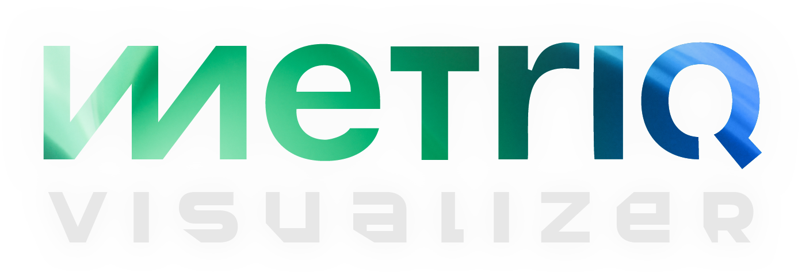
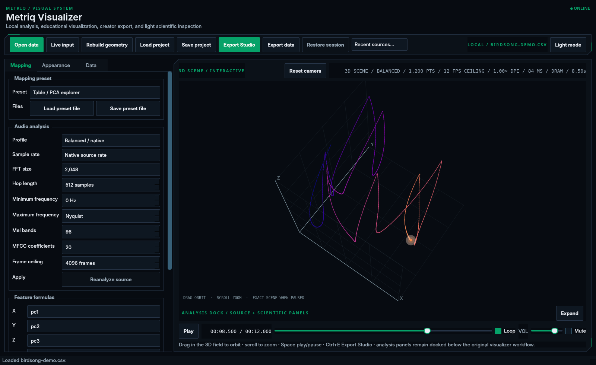
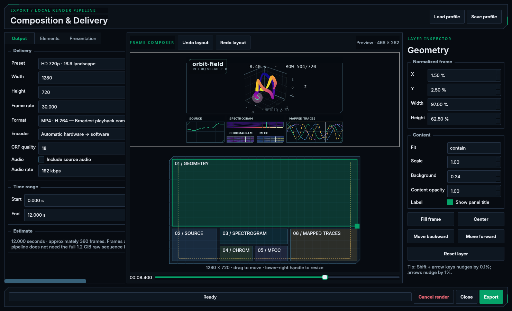

# Metriq Visualizer v1.12.5

Metriq Visualizer is an open-source, local-first **interactive 3D media and data visualizer** for creators, educators, students, field observers, and light scientific work. It maps audio, video, CSV, TSV, TXT, and XLSX sources into formula-driven three-dimensional geometry, synchronized analysis panels, reusable projects, and finished video or image exports.

Version 1.12.5 is a complete source distribution. It keeps the restored original visualizer workspace and corrects camera interaction, extraction controls, live effects, and microphone visualization without replacing the application shell.



## 1.12.5: camera, extraction, and real-time input repairs

- **Stable camera control:** autorotation uses an independent wall clock, mouse orbit uses bounded logical-pixel deltas, and zoom transforms the complete coordinate field—including grid and axes—instead of scaling only the data artists.
- **Visible live effects:** spline smoothing and motion accents remain available in ordinary preview profiles; expensive tube meshes may still use a centerline proxy during motion.
- **Fine adjustment:** trail, fade, opacity, line, point, camera, tube, and motion controls use smaller practical increments.
- **Restored audio extraction:** sample rate, FFT size, hop length, minimum/maximum frequency, Mel-band count, MFCC count, and analysis-frame ceiling are functional, cache-aware, and project/preset-persistent. A Legacy v1.10 profile restores the historical 22,050 Hz / 2,048 FFT / 256 hop configuration.
- **Integrated live microphone mode:** Live Input is an embedded dock that maps incoming audio into the main 3D viewport. The capture engine retries the operating-system default input and packaged macOS builds declare microphone usage in their application metadata.
- **Control organization:** color-map selection is in Appearance, while extraction controls are in Mapping.

See [`CHANGELOG.md`](CHANGELOG.md), [`UPGRADE_1_12_5.md`](UPGRADE_1_12_5.md), and [`docs/VALIDATION_1_12.md`](docs/VALIDATION_1_12.md).

## Stage Output and updates

**Stage Output** keeps the operator workspace separate from an audience display. Open it from the command bar (or `Ctrl+Shift+P`), choose the projector or second display, then use the familiar composition canvas to enable, position, resize, and order geometry, source, spectrogram, chromagram, MFCC, and mapped traces. Its background can be a color, static image, or muted looping video. The stage window mirrors already-rendered canvases at an adjustable 5–30 fps, so it does not start a competing analysis or 3D render loop; press `Esc` on the audience display to close it.

On normal app launches, Metriq checks the official GitHub releases in the background. **Check updates** runs the same check on demand. Only newer non-prerelease macOS app archives with GitHub's SHA-256 digest are eligible. After explicit approval, Metriq verifies the archive digest, bundle identity/version, and macOS signature before it closes and replaces itself; release source ZIPs and unverifiable assets are never auto-installed.

## 1.12.2 foundation: restore the visualizer as the product core

The v1.12.0/v1.12.1 application shell moved too far away from the original Visualizer. In particular, it replaced the original genuine Matplotlib 3D scene with a flattened projection in the primary workflow. That was an architectural regression, not a cosmetic issue.

v1.12.2 corrected it:

- The main window again centers a **real interactive 3D axes scene** with perspective, depth, orbit, zoom, axis controls, labels, trails, splines, tubes, points, color mapping, and autorotation.
- Interactive playback and exported geometry use the same `Matplotlib3DScene` implementation. Export Studio no longer produces a different flattened interpretation of the project.
- The original-style temporal cues are restored: moving comet trail, current-point head, halo, and decaying flash, with adjustable duration and scale.
- Source video, waveform, spectrogram, chromagram, MFCC, and mapped traces are subordinate panels in a collapsible **bottom analysis dock**. The dock starts collapsed so the 3D viewport remains dominant.
- The newer audio playback, Export Studio, cache, live-input, data-export, and reliability work remains available around the restored visualizer instead of replacing it.

This release also fixes data/sample alignment after filtering, full-static head tracking, current-point label selection, ignored label formats, preview-density enforcement, stale Export Studio previews after profile loading, and invisible space reserved by the collapsed analysis dock.

## Core workflow

1. Open local audio, video, or numeric table data.
2. Map extracted/imported features to X, Y, Z, color, and point size with safe formulas.
3. Explore the result in the interactive 3D viewport while the source plays.
4. Adjust trail behavior, temporal accents, path/tube rendering, camera, axes, labels, density, normalization, and color mapping.
5. Expand the bottom dock when waveform, source video, spectrogram, chromagram, MFCC, or mapped traces are needed.
6. Save a `.mvproj` project or `.mvpreset` visual preset.
7. Open Export Studio to compose, size, and encode the finished deliverable.

## Interactive 3D controls

The main viewport supports:

- mouse-drag orbit and wheel zoom;
- numeric elevation, azimuth, zoom, and autorotation speed;
- points, points + line, tube, and tube + points modes;
- straight or Catmull–Rom-smoothed paths;
- fading trail, cumulative reveal, and full-static history;
- current head, halo, flash, and directional comet controls;
- ghost path, axes, formula-derived axis labels, color scale, and point labels;
- label content by time, dominant frequency, or source index;
- bounded preview density for responsive exploration of long sources.

The current playback head follows time even in Full static mode. Filtering and downsampling preserve source-frame indices so labels, HUD values, and dominant-frequency readouts correspond to the correct original sample.

## Live performance profiles

| Profile | Default live budget | Target rate | Moving-scene behavior |
|---|---:|---:|---|
| Fast preview | 650 points | 15 fps | Lowest-density QPainter trajectory; spline and selected temporal accents remain visible |
| Balanced | 1,200 points | 12 fps | Recommended normal-computer profile |
| High quality | 1,800 points | 8 fps | Denser moving trajectory and selected presentation detail |
| Full live simulation | 6,000 points | 5 fps | Highest live density; exact polygonal tube surfaces remain a paused/export operation |

Playback, autorotation, camera drag, and microphone input use a low-latency QPainter renderer over the already-mapped XYZ geometry. Paused inspection and Export Studio retain the exact Matplotlib 3D scene. The two paths share camera, trail, spline, color, size, and motion-accent state; data, grid, and axes use the same live projection and zoom. Adaptive density and high-DPI limits affect only the moving viewport, never saved creator settings or export resolution.

## Audio and playback

Source playback is connected through Qt Multimedia (`QMediaPlayer` and `QAudioOutput`) with:

- play/pause, seeking, looping, volume, and mute;
- media-clock synchronization when the host backend supplies position updates;
- a monotonic local visual-clock fallback when the backend stalls or no output device is exposed;
- separate playback and render timers, preventing the timer-starvation defect that previously froze the display while Play was active.

Silent video remains usable as a synchronized source-preview layer, while audio-only sources show a waveform in the analysis dock.

## Export Studio



Export Studio provides six independently configurable composition layers:

1. 3D geometry
2. Source preview
3. Spectrogram
4. Chromagram
5. MFCC
6. Mapped traces

Each layer can be enabled or excluded, dragged, resized, reordered, positioned numerically, content-scaled, fitted using contain/cover/stretch, titled, and assigned independent content/background opacity. The editor includes undo/redo, snapping, safe-area guides, normalized coordinates, reusable `.mvexport` profiles, and balanced, geometry, analysis, overlay, and vertical layouts.

Creator-facing presentation controls can independently include or exclude:

- project title and subtitle;
- watermark;
- axes and axis labels;
- color scale;
- in-scene technical HUD;
- global timecode.

The geometry layer is rendered by the same true 3D scene used in the main window.

### Formats

| Output | Typical use | Source audio |
|---|---|---:|
| MP4 H.264 | Broad delivery compatibility | Yes |
| MP4 H.265/HEVC | Smaller delivery files | Yes |
| WebM VP9 | Open web delivery | Yes |
| MOV ProRes 422 HQ | Editing master | Yes |
| MOV ProRes 4444 | High-fidelity editing master | Yes |
| Animated GIF | Short silent loops | No |
| PNG sequence | Lossless frame workflow | No |
| JPEG sequence | Smaller frame workflow | No |

Resolution presets cover 720p, 1080p, 1440p, 4K, square, 4:5 portrait, vertical 1080, and vertical 4K. Custom dimensions range from 160×160 through 7680×7680, with frame rates from 1 through 240 fps.

H.264 and HEVC support automatic encoder selection with software fallback, plus explicit NVIDIA NVENC, Intel Quick Sync, Apple VideoToolbox, and AMD AMF modes when the local FFmpeg build and hardware support them.

Frames stream directly into FFmpeg. Existing output files are replaced only after a successful encode. Cancelled or failed jobs remove only their own temporary output. Image-sequence exports use collision-free directories and exact frame-count validation.

## Configurable audio extraction

The Mapping tab exposes sample rate, FFT size, hop length, minimum/maximum frequency, Mel bands, MFCC coefficient count, and analysis-frame ceiling. These settings alter actual DSP output, are persisted in projects/presets, and participate in the analysis-cache identity. The **Legacy v1.10** profile restores 22,050 Hz, FFT 2,048, and hop 256; **Birdsong detail** provides a higher-rate, wider-band starting point. Select **Reanalyze source** after changing extraction settings.

## Formula mapping

Media examples:

```text
pc1
0.7 * mfcc_1 + 0.3 * chroma_mean
smooth(spectral_flux, 5)
clip(rms_db, -48, 0)
```

Imported-table examples:

```text
input_1
mean(input_1, input_2)
pc1
delta_magnitude
```

Available helpers include `abs`, `sqrt`, `log`, `log1p`, `exp`, `clip`, `smooth`, `mean`, `avg`, `sum`, `max`, and `min`. Formula evaluation uses a restricted syntax tree; arbitrary Python execution, attribute access, imports, and file/network operations are not permitted.

## Mapping and visual presets

Mapping presets and visual presets remain separate:

- **Mapping presets** set the X/Y/Z/color/size formulas. Legacy formula aliases such as `f0_hz`, `dominant_freq_hz`, `spectral_centroid_hz`, `zcr`, `chroma_entropy`, and `row_index` are available for older projects.
- **Visual presets** set appearance, camera, and geometry sampling without replacing the current mapping. Bundled styles include Data Disco, Glowstick, and Neon Lights.
- User presets can be placed in `~/.metriq_visualizer/presets`, supplied through `METRIQ_PRESET_PATH`, or retained in the repository `presets/` folder. User-directory names take precedence over bundled names.
- The merge tool never replaces an existing `presets/*.mvpreset` file with a bundled file of the same path.

## Analysis, cache, and data export

- Audio/media analysis uses bounded NumPy/SciPy DSP, SoundFile decoding, and FFmpeg fallback.
- Long sources use an adaptive analysis hop with a maximum of 4,096 analysis frames while preserving full duration.
- The optional local compressed cache is validated against source path, size, modification time, and a bounded content sample.
- Extracted features and mapped coordinates can be exported as CSV or compressed NPZ.
- Recent sources and a recoverable local session are stored through Qt settings; there is no account or cloud synchronization layer.

## Live microphone input

The live-input workspace supports input-device selection, bounded capture buffers, waveform, spectrum, rolling spectrogram, RMS, peak, dominant frequency, spectral centroid, zero-crossing rate, recording, WAV export, and one-click handoff of a recording into the normal 3D analysis workflow.

The capture callback only buffers audio. FFT, metrics, rendering, recording writes, and later 3D analysis occur outside the callback. Automatic bird/species or general sound-event identification is not included in this release.

## Install from source

Python 3.10 or newer is required. Python 3.11 or 3.12 is recommended.

### Linux

```bash
sudo apt update
sudo apt install ffmpeg python3 python3-pip python3-venv \
  libgl1 libegl1 libxkbcommon-x11-0 libxcb-cursor0 libpulse0 libportaudio2

cd Metriq-Visualizer-v1.12.5
python3 -m venv .venv
source .venv/bin/activate
python -m pip install --upgrade pip
python -m pip install -r requirements.txt
python metriq_visualizer_app.py
```

Or use `./run_linux.sh`.

### macOS

```bash
brew install python ffmpeg portaudio
./run_macos.command
```

See [`docs/MACOS.md`](docs/MACOS.md).

### Windows

Install Python 3.10+ and FFmpeg, then run:

```bat
run_windows.bat
```

See [`docs/WINDOWS.md`](docs/WINDOWS.md).

## Projects and settings

- `.mvproj` stores source reference, mapping, visual controls, camera, layout, and session state. Relative source paths are used when possible.
- `.mvpreset` stores mapping and appearance controls without binding to a source.
- `.mvexport` stores output, codec, range, presentation, and composition settings.
- Earlier `.bgl` project files remain routed through the legacy project loader where compatible.

## Source layout

| Module | Responsibility |
|---|---|
| `metriq_visualizer_app.py` | Original-style Qt workspace and workflow orchestration |
| `metriq_visualizer_3d.py` | Shared interactive/offscreen true 3D scene and temporal effects |
| `metriq_visualizer_core.py` | Local analysis, safe formulas, and geometry mapping |
| `metriq_visualizer_panels.py` | Collapsible bottom source/scientific dock |
| `metriq_visualizer_performance.py` | Live-only workload profiles, adaptive density, and effect simplification |
| `metriq_visualizer_render.py` | Layer composition and shared 3D export integration |
| `metriq_visualizer_layout.py` | Resolution-independent six-layer layout model |
| `metriq_visualizer_export_studio.py` | Direct-manipulation export interface |
| `metriq_visualizer_export_pipeline.py` | Profiles, codecs, FFmpeg streaming, and sequences |
| `metriq_visualizer_live.py` | Bounded microphone capture and live DSP |
| `metriq_visualizer_cache.py` | Content-validated local analysis cache |
| `metriq_visualizer_projects.py` | `.mvproj` persistence |
| `metriq_visualizer_preset_files.py` | `.mvpreset` persistence |
| `metriq_visualizer_data_export.py` | CSV and NPZ feature/geometry export |
| `metriq_visualizer_theme.py` | Dark/light Dynamics-inspired presentation |

## Verify

```bash
python tools/verify_source.py --imports
QT_QPA_PLATFORM=offscreen MPLBACKEND=Agg python -m pytest -q
python -m ruff check .
python -m compileall -q .
```

## Import into an existing Git checkout

The package is a complete source tree. To preserve an existing `.git` directory and history, use the additive merge tool:

```bash
python tools/merge_into_repo.py --target /path/to/Metriq-Visualizer --dry-run --json
python tools/merge_into_repo.py --target /path/to/Metriq-Visualizer
```

The tool checksum-verifies the release manifest, backs up every changed destination, writes atomically, rejects unsafe paths/symlinks, never deletes unrelated files, and never modifies Git history. See [`CODEX_IMPORT.md`](CODEX_IMPORT.md).

## Scope

Metriq Visualizer is not an industrial acquisition/control system, a medical or safety-monitoring device, a cloud collaboration platform, or a paid-feature funnel. It is intentionally bounded around creator production, classroom work, local signal exploration, and light scientific inspection.

## License

Source code is licensed under the Mozilla Public License 2.0. Metriq names and brand assets are separately reserved; see `TRADEMARKS.md` and `assets/ASSET_NOTICE.md`.

Copyright (c) 2026 Metriq Foundation, Inc.
